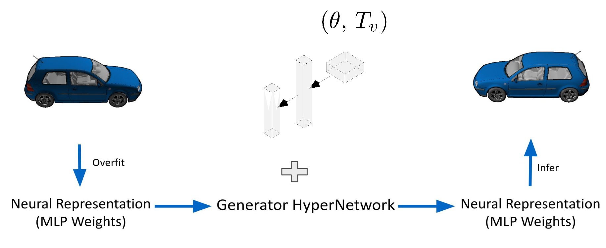
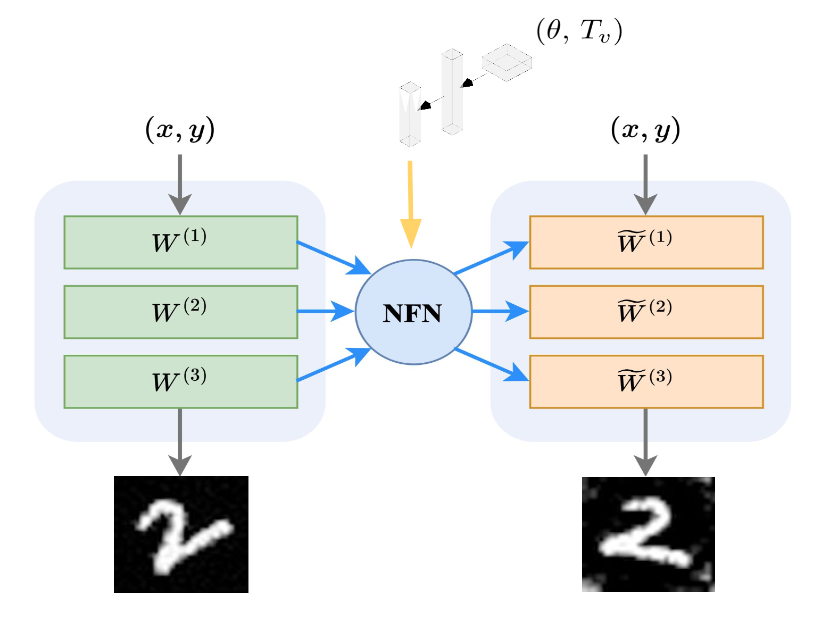
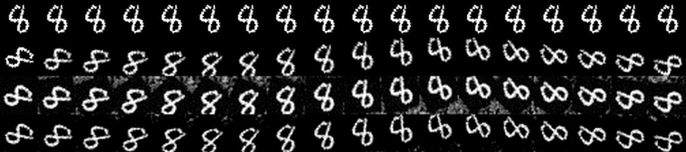

# 3D Affine Transformations on Neural Fields



## Introduction

This project was done by Oleg Magnes and Yusuf Can Aydemir under the supervision of Ziya Erkoç.

Creating neural network architectures that use weights and biases of another neural network as an input is a new and promising field. Possible applications are prediction of input network generalization, classifying implicit neural representations (INRs), or style editing. 

In this work, we used this approach to apply 3D affine transformations to MLPs, representing 2D and 3D shapes, using a HyperNetwork that changes the MLP weights with given transformation. Furthermore, we created a dataset which encodes MNIST images into MLP with SIREN activation.

<p align="center">

</p>

## Installation

```bash
conda create --name 3datonf python=3.11 -y
conda activate 3datonf
python -m pip install -r requirements.txt
```

## Usage
```bash
python train.py \
    --config=./configs/config.py \
    --output_dir=<output directory path>
```


## Available configs
- rotate_config: config for a MNIST-INR rotation and translation NFN training.
- sdf_config: config for a 3D SDF rotation and translation NFN training.
- classification_config:  config for a MNIST-INR classification with NFN.


## Dataset format
```
mnist_inr_dataset
├── 0
│   ├── image0.bmp
│   ├── image30.bmp
│   ├── image45.bmp
│   ├── image<number>.bmp
│   ├── ...
│   ├── model0.pt
│   ├── model30.pt
│   ├── model45.pt
│   ├── model<number>.pt
│   └── ...
├── <number>
│   ├── image0.bmp
│   ├── image30.bmp
│   ├── image45.bmp
│   ├── image<number>.bmp
│   ├── ...
│   ├── model0.pt
│   ├── model30.pt
│   ├── model45.pt
│   ├── model<number>.pt
│   └── ...
... ...
```

## Result



Rows:
1. images obtained from the input INR
2. images with transformation applied in the image space
3. images produced by INRs with tranformations done directly on weights of the first layer
4. images generated by INRs returned by modified NFN